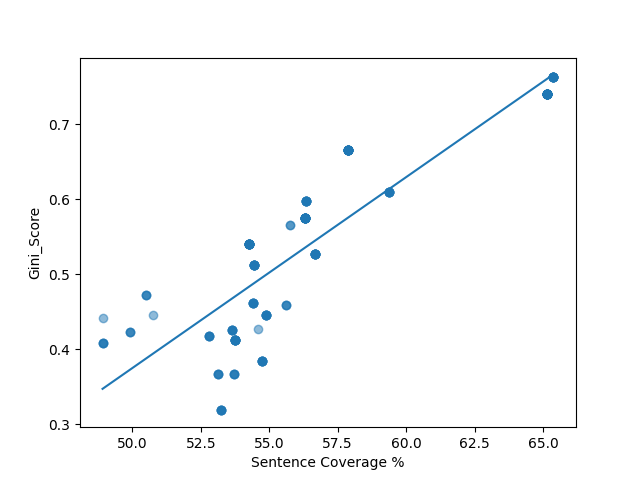
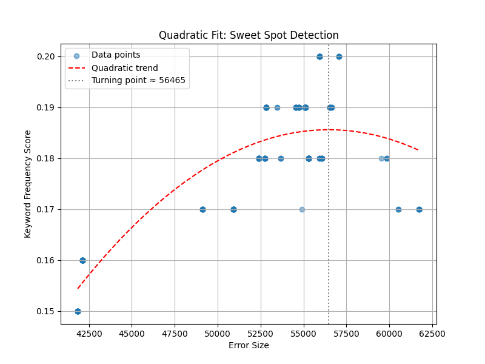

# BERTopic_Stability

# 📘 Evaluating BERTopic Performances

This repository is designed to help **both new and experienced users** get the most out of [BERTopic](https://github.com/MaartenGr/BERTopic), a powerful topic modelling library built on transformer embeddings and clustering.

It provides:
- A **hands-on introduction** for first-time users  
- A structured approach to **comparing and evaluating BERTopic model outputs**  
- A guide to understanding the **performance trade-offs** when tuning model parameters  

All notebooks are **Google Colab–ready** to maximise accessibility — no installation required

---

## 📂 Notebooks & Scripts

| Name                           | Type      | Description                                                                 | Launch |
|--------------------------------|-----------|-----------------------------------------------------------------------------|--------|
| `Sentence_transformer_cleaner.ipynb` | Notebook | Prepares text using Sentence Transformers with token-based chunking         | [](https://colab.research.google.com/drive/1oCK_2MjZkMNMnyh-PgTCH8z5yrVRUGkF?usp=sharing) |
| `Stable_Bertopic.ipynb`       | Notebook  | Runs BERTopic across multiple parameter settings and logs metrics           | [](https://colab.research.google.com/drive/1Jn-AjlzDh5aY2OBXh0BAuXGKl163-Zjq?usp=sharing) |
| `Bertopic_Stats.ipynb`        | Notebook  | Compares model outputs, visualises trade-offs, detects optimal error thresholds - large corpus | [](https://colab.research.google.com/drive/1pjR402nxkRS9657hZsQdIqcSFCLOGiHo?usp=sharing) |
| `Bertopic_Stats_2.ipynb`      | Notebook  | Refines threshold estimation and statistical selection of top model runs - small corpus   | [](https://colab.research.google.com/drive/1lGswsYih7h57R7Ku05aksJlH-jCI0405?usp=sharing) |
| `sample_similarity_pairs.py`  | Script    | Generates cosine similarity labels from BGE embeddings for distillation     | — |

---

## 📈 Summary Statistics

|                       | Mean     | Std. Deviation | Min     | Max     |
|-----------------------|----------|----------------|---------|---------|
| **Error Size**        | 52,221   | 5,298          | 41,846  | 61,754  |
| **Topic 20 Size**     | 600      | 287            | 117     | 1,421   |
| **Gini Score**        | 0.55     | 0.13           | 0.32    | 0.76    |
| **Stability Score**   | 481      | 378            | 199     | 1,212   |
| **Keyword Freq Score**| 0.18     | 0.01           | 0.15    | 0.20    |
| **% Appearance**      | 56.8%    | 4.38%          | 48.91%  | 65.38%  |

> These statistics are derived from over 200 BERTopic model runs using a wide range of `min_cluster_size` and `min_topic_size` settings.

---

## 🔍 Threshold Analysis

- 📍 **Estimated sweet spot**:  
  `Error_Size ≈ 56,465`  
  `Keyword_Freq_Score ≈ 0.186`

- ⚠️ **Suggested maximum threshold**:  
  `Error_Size ≤ 1.08 × mean(Error_Size)`

This sweet spot was derived using a quadratic fit. Models beyond this range often show diminished keyword quality. This provides a normalised, model-independent threshold for selecting optimal runs.

---

## 📉 Example Outputs

### 🔹 Distribution of Error Size


> Shows the distribution of `Error_Size` across 211 model runs. Most cluster between 50,000–55,000.

### 🔹 Gini Score vs Sentence Coverage


> A visualisation of the trade-off between topic balance (Gini) and coverage (% of corpus used).

### 🔹 Sweet Spot Detection


> A quadratic regression identifies the optimal `Error_Size` range for maximising `Keyword_Freq_Score`.

---

## 💡 What You'll Learn

- How to prepare and embed text for BERTopic  
- How to run batch models and log metadata  
- How to evaluate model outputs using statistical and visual techniques  
- How to select high-quality models using a mix of lexical and structural metrics

---

## 📚 Citation

This project builds on [BERTopic](https://github.com/MaartenGr/BERTopic), developed by **Maarten Grootendorst**.

If you use BERTopic in your work, please cite:

> Grootendorst, M. (2022). *BERTopic: Neural topic modeling with class-based TF-IDF*. Retrieved from [https://github.com/MaartenGr/BERTopic](https://github.com/MaartenGr/BERTopic)

```bibtex
@misc{grootendorst2022bertopic,
  author       = {Maarten Grootendorst},
  title        = {BERTopic: Neural topic modeling with class-based TF-IDF},
  year         = 2022,
  publisher    = {GitHub},
  howpublished = {\url{https://github.com/MaartenGr/BERTopic}}
}
